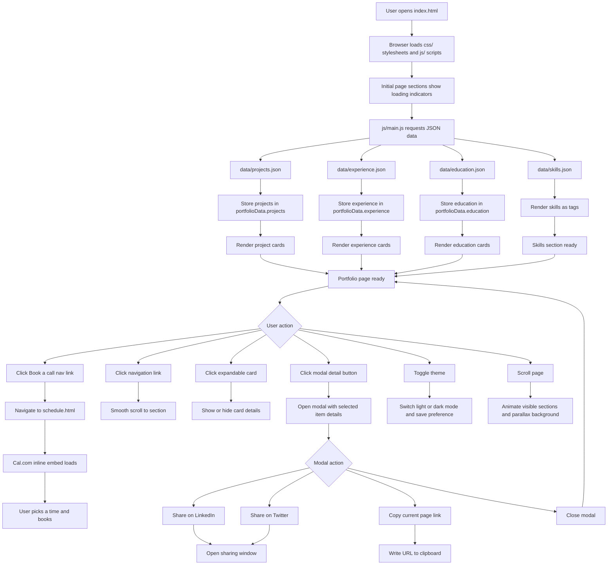
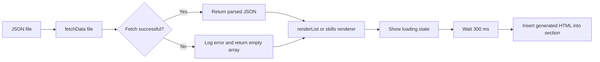

# Portfolio Site Flowchart

```mermaid
flowchart TD
    A[User opens index.html] --> B[Browser loads css/ stylesheets and js/ scripts]
    B --> C[Initial page sections show loading indicators]
    C --> D[js/main.js requests JSON data]

    D --> E[data/projects.json]
    D --> F[data/experience.json]
    D --> G[data/education.json]
    D --> H[data/skills.json]

    E --> I[Store projects in portfolioData.projects]
    F --> J[Store experience in portfolioData.experience]
    G --> K[Store education in portfolioData.education]
    H --> L[Render skills as tags]

    I --> M[Render project cards]
    J --> N[Render experience cards]
    K --> O[Render education cards]
    L --> P[Skills section ready]

    M --> Q[Portfolio page ready]
    N --> Q
    O --> Q
    P --> Q

    Q --> R{User action}
    R --> S[Click navigation link]
    R --> T[Click expandable card]
    R --> U[Click modal detail button]
    R --> V[Toggle theme]
    R --> W[Scroll page]
    R --> S2["Click Book a call nav link"]

    S2 --> X2[Navigate to schedule.html]
    X2 --> Y2[Cal.com inline embed loads]
    Y2 --> Z2[User picks a time and books]

    S --> X[Smooth scroll to section]
    T --> Y[Show or hide card details]
    U --> Z[Open modal with selected item details]
    V --> AA[Switch light or dark mode and save preference]
    W --> AB[Animate visible sections and parallax background]

    Z --> AC{Modal action}
    AC --> AD[Share on LinkedIn]
    AC --> AE[Share on Twitter]
    AC --> AF[Copy current page link]
    AC --> AG[Close modal]

    AD --> AH[Open sharing window]
    AE --> AH
    AF --> AI[Write URL to clipboard]
    AG --> Q
```

## Data Rendering Flow

```mermaid
flowchart LR
    A[JSON file] --> B[fetchData file]
    B --> C{Fetch successful?}
    C -->|Yes| D[Return parsed JSON]
    C -->|No| E[Log error and return empty array]
    D --> F[renderList or skills renderer]
    E --> F
    F --> G[Show loading state]
    G --> H[Wait 300 ms]
    H --> I[Insert generated HTML into section]
```
